# Restaurant Table Ordering

A diner scans the QR code on their table, browses the menu, orders, and watches the status
change on their phone. The kitchen sees the ticket appear on a display board. Staff see
every table, what is ready, and what has been paid.

Six Spring Boot services behind a gateway, Kafka between them, and three React frontends.

---

## What it looks like

One pass through the running stack — the same order seen from the table, the pass and the
floor. Nothing below is a mockup: every shot was taken against the services running locally,
and the screens that update do so from a push, not a reload.

### At the table

<table>
<tr>
<td width="25%">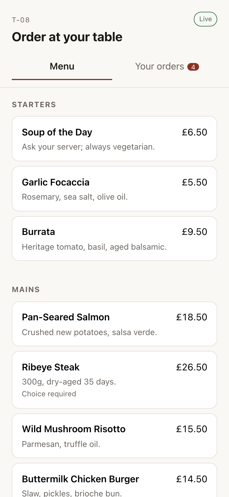</td>
<td width="25%">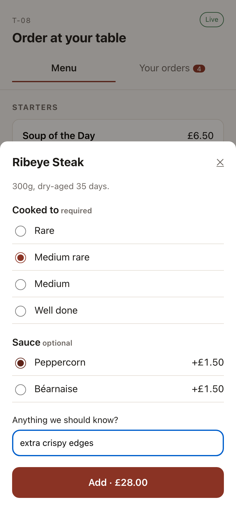</td>
<td width="25%">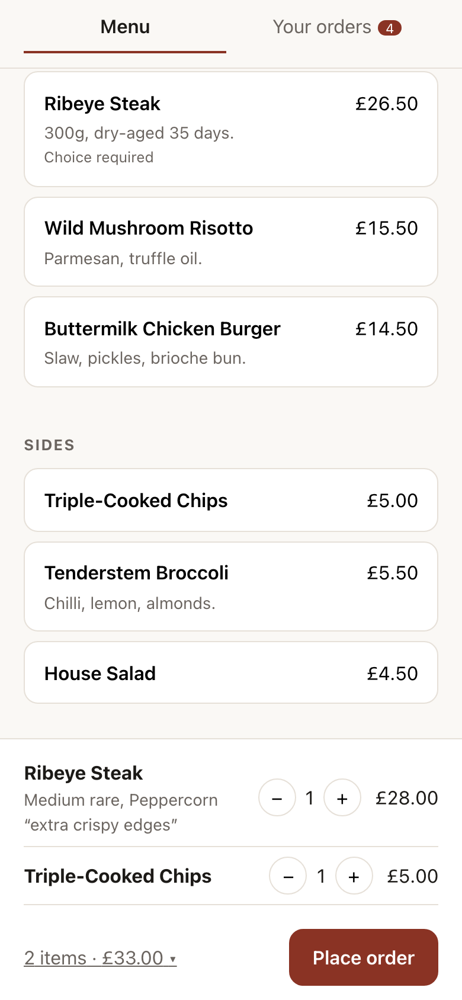</td>
<td width="25%">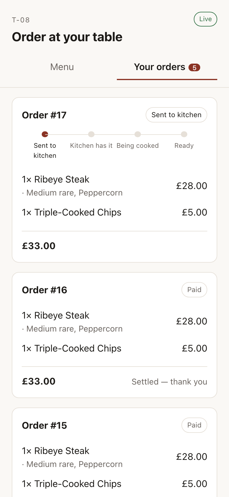</td>
</tr>
<tr>
<td>The QR code opens the table directly. No app, no account, no sign-in.</td>
<td><b>Cooked to</b> is a required group, so <b>Add</b> stays disabled until it is answered.</td>
<td>A summary bar until it is tapped, so the menu keeps the screen.</td>
<td>Placing the order switches to the tracker.</td>
</tr>
</table>

### On the pass

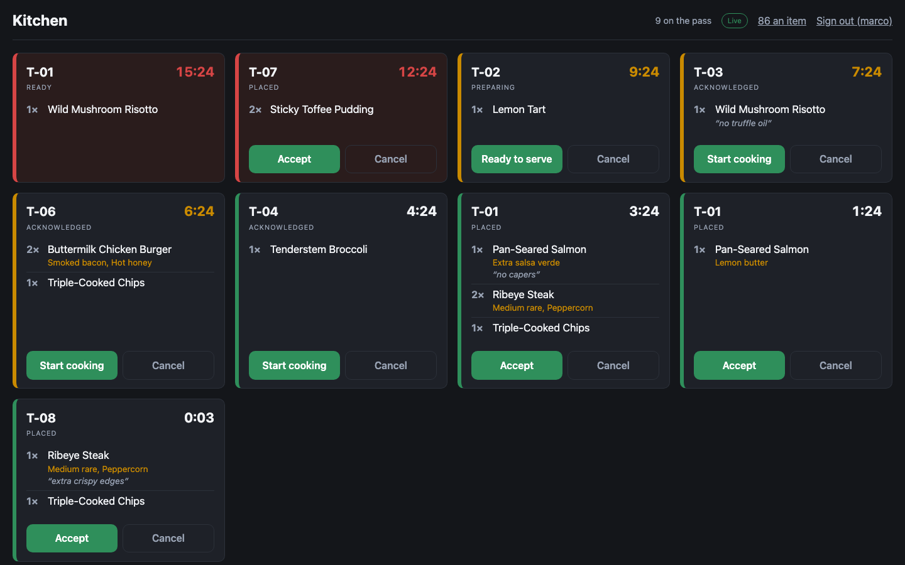

Colour is never the only signal — border weight, background and the elapsed clock carry the
same information. The clock is re-derived locally every second rather than waiting for a
push, so a ticket at 4:59 turns amber on its own and keeps counting even if the socket drops.
T-01 has been waiting fifteen minutes here; T-08's ticket has just landed.

<table>
<tr>
<td width="50%">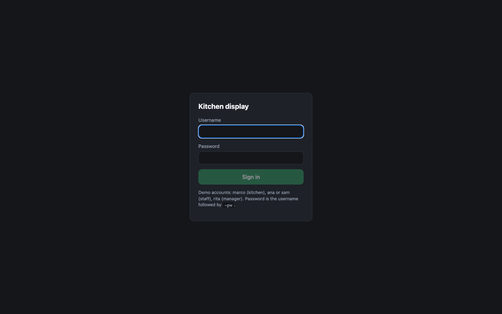</td>
<td width="50%">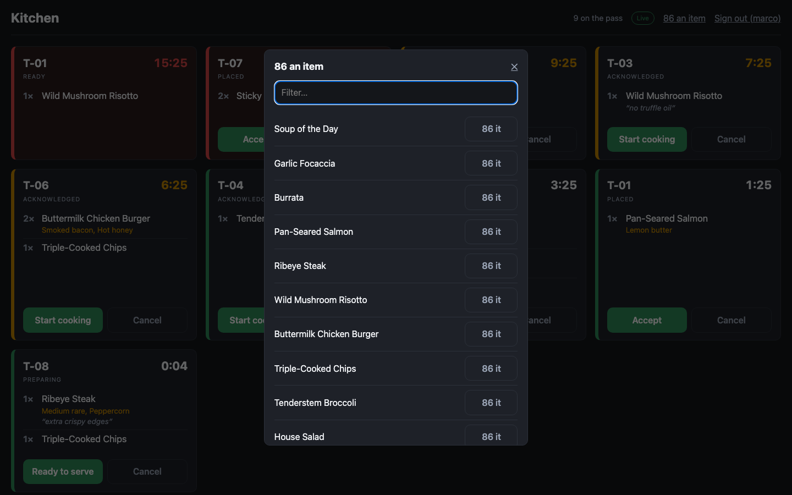</td>
</tr>
<tr>
<td>Sign-in is shared with the staff app; the role decides which screens open. Every endpoint re-checks it server-side regardless.</td>
<td>Marking an item off publishes to menu-service rather than writing anything locally — that single path is what makes the next screen work.</td>
</tr>
</table>

### The two flows, actually happening

<table>
<tr>
<td width="50%">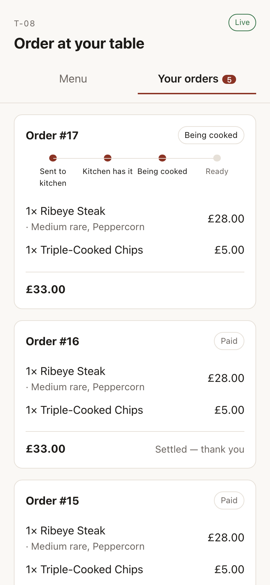</td>
<td width="50%">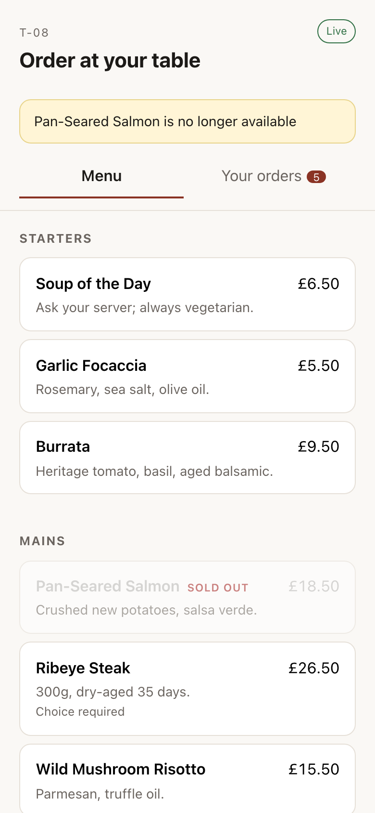</td>
</tr>
<tr>
<td>The cook tapped <b>Start cooking</b> on the board a second earlier. This phone was never reloaded: the tap published an intent, order-service published the fact, and the tracker moved.</td>
<td>The salmon was 86'd on the pass. It greys out in place rather than vanishing, so a diner who was reading it sees where it went instead of watching the list reflow.</td>
</tr>
</table>

### Settling up

<table>
<tr>
<td width="50%">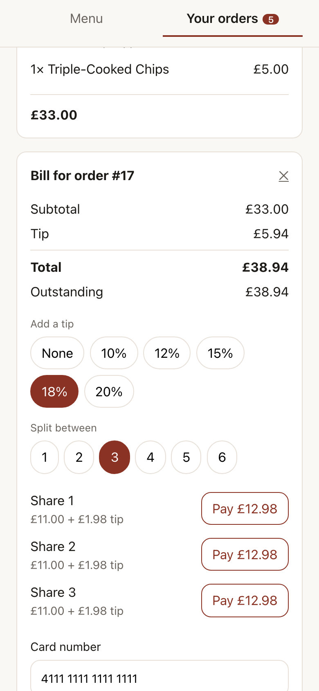</td>
<td width="50%">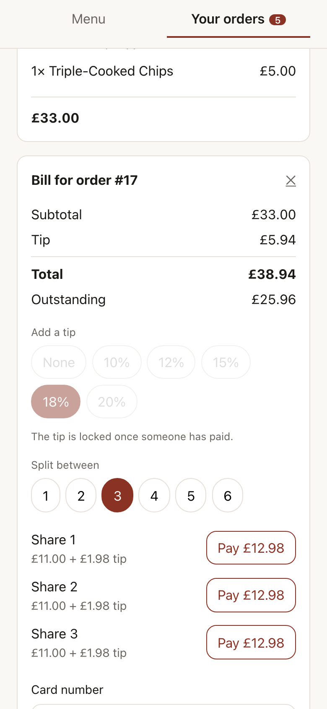</td>
</tr>
<tr>
<td>The server computes the split, so the client never divides money and the shares always add back up to the bill.</td>
<td>Once one share is paid the tip chips lock — changing it now would silently re-price a share that has already settled.</td>
</tr>
</table>

### Front of house

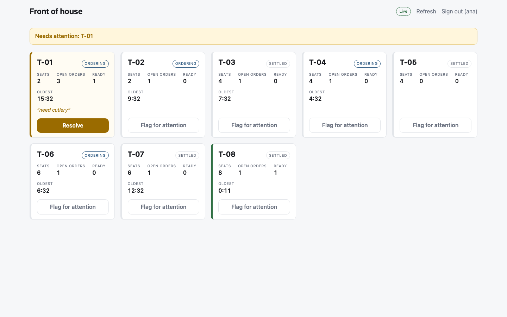

<table>
<tr>
<td width="50%">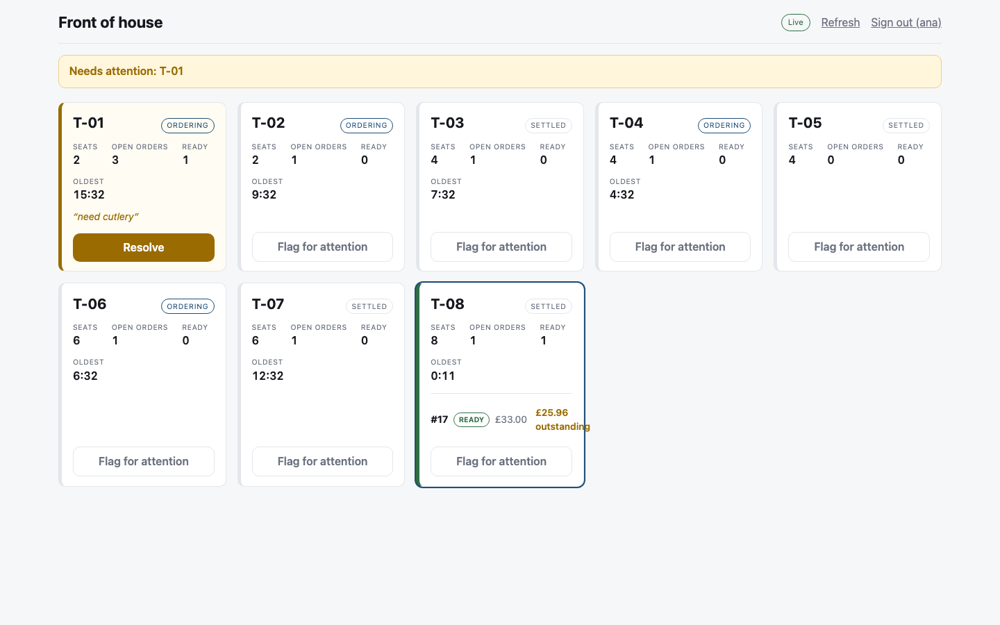</td>
<td width="50%">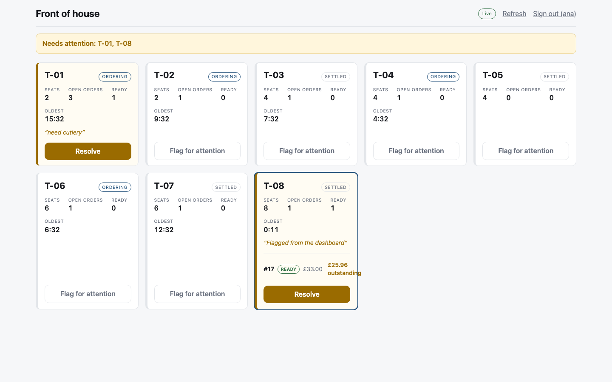</td>
</tr>
<tr>
<td>Expanding a table shows its orders and what is still outstanding on the bill.</td>
<td>Flagging raises the table in the banner at the top of the board.</td>
</tr>
</table>

---

## Running it

| | | |
|---|---|---|
| **JDK 25** | required, not just recommended | the build sets `maven.compiler.release=25`, so an older JDK fails with `release version 25 not supported` |
| **Node 20.19+** or **22.12+** | | Vite 8's floor; Node 20.10 will not start the dev server |
| **Docker** | | Kafka, Postgres and Redis run in containers |

```bash
./scripts/dev.sh start          # infra containers, then every service
cd frontend && npm install && npm run dev
```

`dev.sh` sources `scripts/env.sh`, which finds a suitable JDK and pins `JAVA_HOME` for you.
If you run Maven yourself, pin it too — Homebrew's Maven bundles its own JDK and uses it
regardless of what `java` resolves to on `PATH`:

```bash
export JAVA_HOME=$(/usr/libexec/java_home -v 25)
```

Then open:

| | | |
|---|---|---|
| Customer | http://localhost:5173/t/qr-t01-9f3a2b | opens table T-01, as the QR sticker would |
| Kitchen | http://localhost:5174 | sign in as `marco` / `marco-pw` |
| Staff | http://localhost:5175 | sign in as `ana` / `ana-pw` |

Other demo accounts: `sam`/`sam-pw` (staff) and `rita`/`rita-pw` (manager). Every password
is the username followed by `-pw`.

```bash
./scripts/dev.sh status         # what is up
./scripts/dev.sh logs menu-service
./scripts/dev.sh stop           # services only
./scripts/dev.sh down           # services and containers
./scripts/demo.sh               # the whole flow end to end, on the command line
```

### Ports

Infrastructure is deliberately off the default ports — this machine already had a native
Postgres on 5432, and a container publishing the same port loses to the loopback bind,
producing a confusing `role "rto" does not exist` while `psql` inside the container works
fine.

| | | | |
|---|---|---|---|
| gateway | 8080 | Postgres | 5433 |
| menu | 8081 | Redis | 6380 |
| order | 8082 | Kafka | 9094 |
| kitchen | 8083 | customer UI | 5173 |
| table | 8084 | kitchen UI | 5174 |
| payment | 8085 | staff UI | 5175 |
| notification | 8086 | | |

Everything the browser touches goes through the gateway on **8080**, including both
WebSockets. The service ports are for debugging.

---

## How it fits together

```
                        ┌──────────────┐
  customer :5173 ──┐    │              │
  kitchen  :5174 ──┼───▶│ gateway :8080│  edge JWT check, CORS, staff login
  staff    :5175 ──┘    │              │
                        └──────┬───────┘
                               │
   ┌──────────┬────────────┬───┴────┬────────────┬──────────────┐
   ▼          ▼            ▼        ▼            ▼              ▼
 menu      order        kitchen   table       payment      notification
 :8081     :8082        :8083     :8084       :8085        :8086
   │          │            │        │            │              │
   └──────────┴────────────┴────┬───┴────────────┴──────────────┘
                                ▼
                       Kafka · Postgres · Redis
```

Each service owns a Postgres schema (`menu`, `orders`, `kitchen`, `tables`, `payment`) and
never reads another's. notification-service has no database at all — it only turns events
into pushes.

### Where things live

```
├── common-events/          Kafka contracts: topics, event records, OrderStatus
├── common-security/        shared JWT issuing and decoding, no web stack
├── common-kafka/           EventPublisher, serializer defaults, topic definitions
│
├── gateway/                routes, CORS, edge JWT check, staff login
├── menu-service/           menu, modifiers, availability, Redis-cached read model
├── order-service/          order aggregate — the only writer of order status
├── kitchen-service/        Kafka fan-in, ticket board, /ws/kitchen
├── table-service/          tables, QR mapping, customer session tokens
├── payment-service/        bill splitting, tips, mock card processing
├── notification-service/   Kafka → /ws/customer, no database
│
├── frontend/
│   ├── packages/shared/    types, API client, session storage, useStomp
│   └── apps/{customer,kitchen,staff}/
│
└── scripts/                dev.sh, demo.sh, env.sh, init-db.sql
```

The three `common-*` modules are plain libraries, not Boot apps. `common-security` is
deliberately free of servlet and reactive types, because the WebFlux gateway and the six
servlet services both depend on it.

The five services that own data — menu, order, kitchen, table, payment — share one internal
shape: `domain/` for entities and the rules that belong to them, `app/` for transactional
services and Kafka consumers, `api/` for controllers and DTOs, `config/` for security and
wiring. The gateway and notification-service are flatter, because neither has a domain of
its own to model: one routes, the other translates events into pushes.

### Topics

| Topic | Produced by | Consumed by |
|---|---|---|
| `orders.events` | order-service | kitchen, notification, table |
| `kitchen.events` | kitchen-service | order |
| `menu.availability` | kitchen, menu | menu, notification |
| `payment.events` | payment-service | order, notification, table |
| `table.events` | table-service | notification |

Every event is keyed by table id, so one table's events stay in order relative to each
other. Ordering *across* tables does not matter and is not preserved.

---

## The two things worth reading the code for

### Order status has exactly one writer

The kitchen, payment-service and the staff dashboard all want to move an order along. None
of them writes its status. They publish an **intent**; order-service validates it against
the state machine in `OrderStatus` and publishes the resulting **fact**, which everything
else treats as truth.

```
cook taps "start"
  └→ kitchen-service publishes KitchenTicketAdvanced   (an intent)
       └→ order-service checks OrderStatus.canTransitionTo
            ├→ illegal? dropped, nothing published
            └→ legal?   publishes OrderStatusChanged   (the fact)
                 └→ kitchen board, customer phone, staff dashboard all update
```

Without this, two kitchen terminals double-tapping the same ticket produce two conflicting
writes and no authority to reconcile them. `advance()` returns a boolean rather than
throwing, so a redelivered Kafka intent is dropped instead of retried forever — Kafka is
at-least-once, so duplicates are normal, not exceptional.

### "We just ran out of salmon"

```
kitchen board taps 86
  └→ ItemAvailabilityChanged           → menu.availability
       └→ menu-service (owns menu state)
            ├→ UPDATE menu_item SET available = false
            ├→ evict menu::full from Redis          ← after commit, not before
            └→ MenuInvalidated                       → menu.availability
                 └→ notification-service
                      └→ /topic/menu → every open table session refetches
```

Two details carry this:

**Eviction happens after the transaction commits, not via `@CacheEvict`.** The annotation
fires when the method returns but before the commit, leaving a window where a concurrent
reader repopulates the cache from the old row and the new value commits behind it — a stale
menu that survives until the TTL, with no error anywhere. A 10-minute TTL is the backstop,
not the mechanism.

**Redis is shared, so one eviction covers the fleet.** A local cache would need its own
invalidation broadcast to do the same job.

Order placement re-reads availability from menu-service anyway, so a cart that sat open
while the item sold out is rejected rather than accepted against a stale menu.

---

## Notes on the design

**Two WebSocket paths, both authenticated on the STOMP frame.** Browser WebSocket APIs
cannot set an `Authorization` header on the handshake, so the token travels in the `CONNECT`
frame. The kitchen board authenticates; the customer stream also **authorises each
`SUBSCRIBE`** — the table id is part of the destination, so a diner at table 3 asking for
`/topic/tables/4` is refused. Authenticating without that second check would let any valid
table session read every other table's orders and payments.

That check is a **whitelist** — the menu topic, plus the session's own table, and nothing
else. It was originally written the other way round, refusing another table's
`/topic/tables/<id>` and permitting anything that did not match that prefix. Which left
`/topic/orders/<id>` open to every customer session, and that destination receives the same
`ORDER_STATUS` and `PAYMENT` pushes, outstanding balance included. `GET /api/orders/9`
answers 403 to a diner at another table, but the broker never consults order-service before
pushing, so the HTTP check does not cover the socket — and order ids are sequential, so
guessing one is not work. A blacklist has to anticipate every destination that will ever
exist; a whitelist only has to name the two that are wanted.

**Real-time consumers use a per-instance Kafka group.** WebSocket sessions live in the
memory of whichever instance the browser reached, so every instance must see every event. A
stable group id delivers each event to one instance and leaves boards and phones attached to
the others silently stale — invisible on one instance, worst under scale-out.

**Money is integer cents everywhere.** £80.50 split three ways has no exact representation,
and rounding each share independently produces shares that do not add up to the bill. The
remainder is spread one cent at a time over the earliest shares (26.84 / 26.83 / 26.83), and
the bill and tip are split separately so one payer cannot absorb both remainders.

**The client never sends prices.** An order carries item ids, quantities and modifier ids.
Everything is priced from menu-service, so there is no field to tamper with.

**Failed payments are recorded in their own transaction.** A decline throws, which would
roll back an attempt row written in the same transaction and silently destroy the audit
trail. `PaymentAuditService` uses `REQUIRES_NEW`, in a separate bean because a
self-invocation would bypass the proxy.

**The kitchen board re-derives wait times locally each second.** A ticket at 4:59 would
otherwise stay green until an unrelated push arrived, and the clock would freeze entirely
while the socket was down. Colour is never the only signal — border weight, background and
the elapsed clock carry it too.

---

## Testing

```bash
mvn test                              # 65 backend tests
cd frontend && npx vitest run         # 22 frontend tests
./scripts/demo.sh                     # end-to-end, against the running stack
```

The unit tests concentrate on the two places a silent error would be expensive: the order
state machine (every legal transition, and the illegal ones enumerated individually —
skipping ahead, going backwards, reviving a cancelled order, self-transitions from duplicate
events) and the money arithmetic (shares always sum back to the original, no two shares
differ by more than a cent, tips round half-up).

---

## Toolchain

Spring Boot **4.0.7** with Spring Cloud **2025.1.2** — these are coupled, the Cloud BOM
declares `spring-boot.version=4.0.7`. Java 25, React 19, Vite 8.

Four Boot 4 details that cost real debugging time:

- **Auto-configuration was split into per-technology modules.** `flyway-core` alone means
  migrations silently never run; `spring-kafka` alone means no `KafkaTemplate` is ever
  created; `spring-boot-starter-web` no longer supplies a `RestClient.Builder`. Each needs
  its `spring-boot-flyway` / `spring-boot-kafka` / `spring-boot-restclient` companion.
- **Jackson 3.** spring-kafka and Spring Data Redis each ship two serializer families; the
  legacy Jackson 2 ones (`JsonSerializer`, `Jackson2JsonRedisSerializer`) have no
  `java.time` support here, so anything carrying an `Instant` fails. Use the unprefixed
  `JacksonJsonSerializer` / `JacksonJsonRedisSerializer`.
- **The gateway starter was renamed** to `spring-cloud-starter-gateway-server-webflux`; the
  old artifact stopped at 4.3.5.
- **Spring Security also guards the `ERROR` dispatch.** Without permitting it, a handler
  exception is re-dispatched to `/error` and returns 401 — which makes any internal failure
  look like an authentication problem.

Two more that only appear in a browser, both about the gateway sitting in the middle. Neither
shows up in `curl`, `mvn test` or `demo.sh` — all three talk to the gateway without an
`Origin` header and without a WebSocket:

- **CORS belongs in exactly one place.** The gateway sets it at the edge, but kitchen-service
  and notification-service each configured it again for themselves, so every proxied response
  carried `Access-Control-Allow-Origin` twice. A browser rejects that outright — *"contains
  multiple values `http://localhost:5174, http://localhost:5174`, but only one is allowed"* —
  and the kitchen board could not load a single request. Two identical values are still two
  values. The four services that never configured CORS were always fine.
- **Spring Cloud Gateway does not relay `Sec-WebSocket-Extensions`.** The browser offers
  `permessage-deflate` on the handshake; the gateway passes the offer downstream, Tomcat
  accepts it and starts setting `RSV1` on compressed frames, but the acceptance header never
  makes it back to the browser. So the browser, which believes nothing was negotiated, sees a
  reserved bit set and kills the socket: *"One or more reserved bits are on"*. The handshake
  succeeds and the status pill even reads **Live**, which is what makes it confusing — it
  dies on the first frame large enough to compress. The gateway now strips the offer on the
  way in, so both ends agree on no compression.

`scripts/env.sh` pins `JAVA_HOME`, because Homebrew's Maven uses its own bundled JDK
regardless of what `java` resolves to on `PATH`.

`frontend/.npmrc` sets `legacy-peer-deps`: npm 11.4.1 crashes walking vitest 4's optional
peer set. Installing `@vitest/ui` to satisfy that peer would pull in the very component the
advisory that motivated the vitest 4 upgrade was about.
